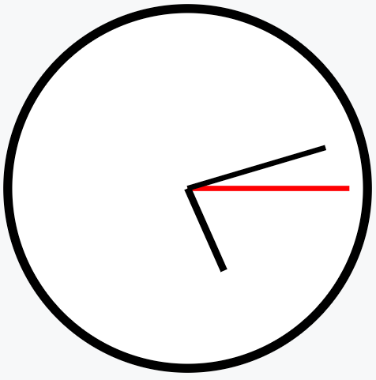

# Learn Go With Tests

[🔖](https://quii.gitbook.io/learn-go-with-tests/testing-fundamentals/intro-to-acceptance-tests)

## Go Fundamentals
### [Hello, World](https://quii.gitbook.io/learn-go-with-tests/go-fundamentals/hello-world)

*Testing syntax tips...*

- test files are suffixed with _SOMENAME_`_test.go`
- the test func starts with `Test`_SomeName_
- `t` is the hook to the testing framework with methods like `t.Fail()` and `t.Errorf(...)`
  - the testing framework gives you a `t` you can call methods on
- `*testing.TB` is an interface combo of `T` test and `B` benchmark
- `t.Helper` required for safe debugging with helper methods
  
*useful shortcuts...*

- `cmd` + `1` => hide/show project tree
- `cmd` + `e` => view recent files
- `ctrl` + `shift` + `r` => run tests
- `cmd` + `b` => jump to declaration

*General testing tips...*

- use subtests to triangulate on a general behaviour
- you can include examples in test files
  - ```go
    func ExampleAdd() {
    sum := Add(1, 5)
    fmt.Println(sum)
    // Output: 6
    }```
- Go lets you test private functions ... but you shouldn't because it's healthier to test public _behaviour_
    
*General Go tips...*

- command for running `go test` is `go mod init SOMENAME`
- declare vars with `:=`
- build a string with placeholder values `%q` (q: double quotes) [see fmt package](https://pkg.go.dev/fmt)
- define constants with `const`
- Use a _named return value_ and avoid explicitly declaring it in the method body
  - it will be assigned the empty value of the type, eg `""` or `0`
  - `return` will return the _named return value_, no need to explicitly return the var
  - it will be automatically added to the Go Doc
- public funcs are announced in `PascalCase` and private funcs are whispered in `camelCase`
- Go does not allow method overloading;
  - you can have methods with the same name in their own packages
  - you can define methods on the type instead, eg shapes' _Rectangle struct_


**TDD Cycle**

1. Write a test -> Make compiler pass 
2. Run the test -> Check the error message
3. Write enough to make it pass
4. Refactor

### Benchmarking

`b testing.B` -> `b.N` executes the benchmark code n times & measures the time is takes.
run from the containing directory:

```go
  func BenchmarkRepeat(b *testing.B) {
      for i := 0; i < b.N; i++ {
          Repeat("❤️")
      }
  }
```

```bash
  % go test -bench=.
  
  goos: darwin
  goarch: arm64
  pkg: hello/iteration
  BenchmarkRepeat-8       14493148                82.71 ns/op
  PASS
  ok      hello/iteration 2.430s
  ```

### Coverage

Go has a built-in coverage tool, you can run in the terminal - really helpful to check you're not losing coverage when deleting tests

```bash
% go test -cover    
PASS
        hello/arraysandslices   coverage: 100.0% of statements
ok      hello/arraysandslices   0.129s
```

### Arrays

Arrays have a fixed capacity which is defined when declared:
```go
// that could look like this
myArray1 := [5]int{1, 2, 3, 4, 5}
// or like this
myArray2 := [...]int{1, 2, 3, 4, 5}

// use slices for collections of variable length
mySlice1 := []int{1, 2, 3, 4, 5}
// or like this
mySlice2 := make([]int, 5)
```
**Arrays...**

- the `%v` placeholder works well for arrays
- use `array[index]` to get the value at that index
- `range` lets you use syntax like for number in numbers
  - `for _, number := range numbers { //do something }}`
- arrays of different sizes are **different types**

**Slices**

- you can't use equality operators (`==` etc), you can use `reflect.DeepEqual` instead
  - DeepEquals isn't type safe so will compile even when types are mismatched
  - (but your test should fail...!)
- use `slice[index]` to get the value at that index 
  - or, set a value at that index `slice[index] = 19`
  - setting a value to an index that doesn't exist yet will throw a `runtime error`
  - so, use `append` instead, `slice = append(slice, 19)
- `slice[low:high]` slices the contents of the slice into a spanning chunk
  - leave blank on one of the sides of the `:` to capture everything to that side of it

## Structs, methods & interfaces

**Structs**

- A struct is a named collection of fields where you can store data.
- Can use a struct to create a simple type, eg _rectangle_
- Declare a struct like this,
  - ```go
    type Rectangle struct {
      Width  float64
      Height float64
    }
  ``` 
- Or an anonymous struct, for example,
  - ```go
    // We are declaring a slice of structs by using []struct with two fields
    areaTests := []struct{
      shape Shape
      want float64
    }{
      {Rectangle{12, 6}, 72.0},
      {Circle{10}, 314.1592653589793},
    }
  ```
    
**Interfaces**

- interface resolution is implicit
- If the type you pass in matches what the interface is asking for, it will compile
- Declare an interface like,
  - ```Go
    type Shape interface {
    Area() float64
    }```
- using interfaces to declare only **what you need** is important design

## Pointers & errors

**Pointers**

Unlike Java, Go creates copies of symbols, so to create Java-like behavior with references, you need to change the receiver type to a pointer

```Go
// Receiver type `*Wallet` is "a pointer to a wallet"
func (w *Wallet) Deposit(amount int) {
	w.balance += amount
}
```

- In your print strings you can use `&w` as an arg for `%p` placeholder;
  - `&w` this syntax creates a pointer to a wallet
  - use e.g. `fmt.Printf("%p \n", &wallet)` to get visibility of the address in memory

**Errors**

- `nil`s cause _runtime panic_s in Go just like `null`s cause _null pointer_s in Java
- Error messages can be assigned to package-global variables: `var MyError = errors.New("oh dear")`
- You can use a program like `errcheck` on the command line to check your error test coverage
  - unchecked errors: 
  ```Bash
  % errcheck ./...              
  pointersanderrors/wallet_test.go:38:18:	wallet.Withdraw(Bitcoin(10))
  ```
  - happy path: 
  ```Bash
  % errcheck ./...
  %              
  ```

## Maps

- Keys are comparable types: all keys in the map need to be of the same (comparable) type - but the values don't have to be
- Add to a map by specifying the key and set it equal to the value:
  - ```go
    dictionary["cat"] = "soft and sleepy cuddle monster"
  ``` 
- `nil` maps will read like an empty map but attempting to write to a `nil` map will make a runtime panic
  - avoid initialising an empty map like `var m map[string]string` by:
  - ```go
    // always adding {}
    var m map[string]string{}
    
    // or using `make`
    var m = make(map[string]string)
  ```
- Go has a built-in function delete that works on maps `delete(map, key)`


## Dependency Injection

- injecting a dependency allowed us to
  - test the code
    - hard-wired dependencies or global state make testing hard, DI will let you mock a dependency via an interface
  - separate concerns
    - decouple where the data goes from how its generated
    - enable single responsibility principle
  - enable re-use... including in tests!
    - more dependencies can be injected as the requirements grow

## Mocking

- Can use mocks to make tests faster than actual behaviour
  - e.g a test for countdown that takes 3 real seconds doesn't need to use those 3 seconds in the test
  - and you can avoid slow/expensive feedback loops, like setting up dbs and waiting for responses
- Too many mocks can indicate poor abstraction of the world you're modelling
- If mocking is complicated it could be because...
  - you have too many dependencies to mock (> 3 is a red flag) -> can the thing you're testing be responsible for less?
  - dependencies are too fine-grained -> can they be consolidated into a meaningful module?
  - you're testing implementation detail -> test behaviour not how its implemented
- Spies should be used with caution, as they tighten the coupling between your test and the way the behaviour is implemented
- Generate mocks against an interface - thats all you need!

## Concurrency

- _blocking_ operations need to finish before the next op can start
  - non blocking ops run in a _goroutine_ process, that reads through code like a gemino curse :D
    - to start a new _goroutine_ use the `go` call before the function call
    - _goroutines_ are often used with _anonymous functions_ which remain in their existing scope:
    - ```go
      go func() {
        doSomething()
      }()
    ``` 
- a _race condition_ bug is when output is dependent on timing/sequence which isn't controlled
  - use _channels_, a data structure that can send and receive values & therefore communicate between processes

## Select

- Use `defer` keyword to keep a call inline but move the action to the end - eg defer close, when you opened a server
- you cannot send to `nil` channels, so always `make` them
- `chan struct{}` is the smalled data type in memory (there is no zero value to be initialised with)
- `var := <-ch` is a _blocking_ call
- `select` allows you to wait on multiple channels - the first to send a value wins
  - add `time.After` in one of the `cases` so you're not blocked forever
  - ```go
    select {
    case <-doSomething(a):
      return a
    case <-time.After(10 * time.Seconds):
      return "too slow!"
    }
  ```
- `httptest` lets you create test servers that are consistent with _real_ http servers
  
## Reflection

- `interface{}` can be used as a placeholder for any type
- `any` is an alias for `interface{}`
- Go has a `reflect` package for when you have no way of knowing what types might exist
- Avoid reflection though because it adds a lot of complexity and code can break in unanticipated ways

## Sync

- embedding types means the methods of that type becomes part of the public interface; and you often will not want that
  - ```go
      type Counter struct {
        sync.Mutex // embedded, and not private!
        value int
      }
      ```
- `Mutex` (mutual exclusion) allows us to add locks to our data
  - Use channels when passing ownership of data
  - Use mutexes for managing state
- `WaitGroup` is a means of waiting for goroutines to finish jobs
- Use `go vet` to check for bugs

## Context

- It's important that you derive your contexts so that cancellations are propagated throughout the call stack for a given request.
- `context.Done()` returns a channel: listen on the channel for a "done" or "cancelled" signal then call `store.Cancel` if we got one:
  - ```go
    case <-ctx.Done():
      store.Cancel()
    ```
- Incoming requests to a server should create a Context, and outgoing calls to servers should accept a Context.
- If you use `ctx.Value`, you’re fired
  - The problem with `context.Values` is it's an untyped map, so you have no type-safety and you have to handle it _not containing your value_.
  - You have to create a coupling of map keys from one module to another and if someone changes something things start breaking.
  - if a function needs some values, put them as **typed parameters** rather than trying to fetch them from `context.Value`. This makes it statically checked and documented for everyone to see.
  - It can be helpful to include information that is orthogonal to a request in a context, such as a trace id
  - `Context.Value` should _inform_, not _control_. it's for maintainers not users.


## Templating

- Use approval tests import `approvals "github.com/approvals/go-approval-tests"` and you can `approvals.VerifyString(t, buf.String())
  - You can compare the approval files by highlighting both in the project view and `cmd` + `D` to dif the two files  

## Math

- `encoding/xml` is the Go package for simple XML parsing
  - `zek` is a program that automates writing XML structure
  - so is https://xml-to-go.github.io/

```svg
<svg xmlns="http://www.w3.org/2000/svg"
     width="100%"
     height="100%"
     viewBox="0 0 300 300"
     version="2.0"><circle cx="150" cy="150" r="100" style="fill:#fff;stroke:#000;stroke-width:5px;"/><line x1="150" y1="150" x2="240.000" y2="150.000" style="fill:none;stroke:#f00;stroke-width:3px;"/><line x1="150" y1="150" x2="226.706" y2="127.279" style="fill:none;stroke:#000;stroke-width:3px;"/><line x1="150" y1="150" x2="170.237" y2="195.722" style="fill:none;stroke:#000;stroke-width:4px;"/></svg>

```




## Generics

- Go gives us type safety
- you can use `interface{}` to accept any types, but 
  - :!: no information at compile time as to what kind of data
  - :!: challenging and bug-prone because we've lost our constraints
  - :!: more likely to have runtime errors which could affect our users, cause outages...
- `Generics`... 
  - are a way to make abstractions but _describe our constraints_
  - allow us to write functions that have a similar level of flexibility that `interface{}` offers but retain type-safety and provide a better developer experience for callers.
- infers the type wanted is given by the caller

eg. 

```go
func AssertNotEqual[T any](got, want T)
```
or

```go
// comparable types you can compare using == operator
func AssertNotEqual[T comparable](got, want T)
```

## Revisiting arrays and slices with generics

- `reduce` is also known as fold, accumulate, aggregate, compress, or inject
- Using generics as a tool for simplifying code via the refactoring step is far more likely to guide you to useful improvements, rather than premature abstractions.
- By adding a second type constraint on `reduce` This allows to Reduce from a collection of A into a B
  - You can have an `A` and `B` that doesn't matter if they're the same `any` type, but _can_ be _different_ `any` types. 
  - ```go func Reduce[A, B any](collection []A, accumulator func(B, A) B, initialValue B) B { ... }```
- Use the TDD process to drive out real, specific behaviour that you actually need, in the refactoring stage you then might discover some useful abstractions to help tidy the code up. 